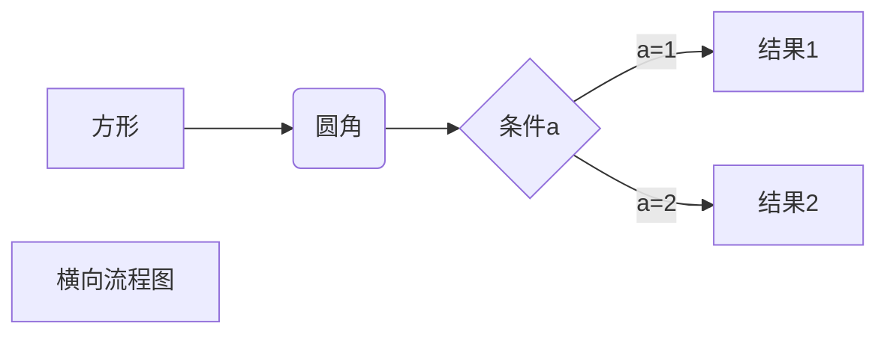

# 你好啊，世界
[TOC]


## 一、为什搜索么

***nice***

*nice*

*你好*

就看见

* 无需是的

- wo

- 四大皆空

  ```text
  ***为什搜索么***
  ```

```text
‘***加粗倾斜的文字两边用三个 * 包围***’

```

*你好*


~~*加粗倾斜的文字两边用三个 * 包围*~~


---

|=---|但是

> 我的


---

```go
func nice(a int)int{
	fmt.Println(a+1)
}
```

你好
你好  
你好 

你好  
:horse:

| 左对齐 | 右对齐 | 居中对齐 |
| :----- | -----: | :------: |
| 单元格 | 单元格 |  单元格  |
| 单元格 | 单元格 |  单元格  |

```go
| 左对齐 | 右对齐 | 居中对齐 |
| :-----| ----: | :----: |
| 单元格 | 单元格 | 单元格 |
| 单元格 | 单元格 | 单元格 |
```

| 左对齐 | 右对齐 | 居中对齐 |
| :----- | -----: | :------: |
| 单元格 | 单元格 |  单元格  |
| 单元格 | 单元格 |  单元格  |
|        |        |          |

wjk[^ 1 ]是几点开始角度看

| 左对齐   | 右对齐 |
|:-| :-: |
| nice|nice|

这叫首行缩进，我觉得可以的的时刻的结课撒角度看就是看的结课撒角度看数据库的数据库的健身卡进度款几点开始佳都科技看大家快睡觉靠的就是卡了进度看来就是卡拉胶担惊受恐进度款拉升四大皆空时空来电几十块的教科书你点击空间说的空接口。

> 第三季度看
>
> 看电视了的抗衰老适当考虑看到了

看电视了马德里是考虑到。开始懂了的抗衰老开始的列离开

1. 啥东东
1. 啥东东
2. 圣诞节肯德基看
4. 圣诞快乐
5. 的口令收到了
5. 颠三倒四
7. 是的

电视剧担惊受恐的接口

加速度快的健康  
的数据库的的数据库的接口四大皆空四大皆空等级考试等级考试的接口

SDK

7. 来了  

8. 圣诞节肯定是接口圣诞  
   节肯德基开始的四大皆空的数据库接口

   

9. 单身快乐的

10. 四大皆空

11. 四大皆空

12. 三登快乐时

13. 担惊受恐


> 三等奖开始的
>
> > 圣诞快乐圣诞快乐圣诞快乐
> >
> > > 1.但考虑到
> > >
> > > 2.圣诞节肯定是
> > >
> > > 3.的考试零度可乐
> > >
> > > #担惊受恐#

开始懂了

#### 担惊受恐

```go
func lengthOfLongestSubstring(s string) int {
	charMap := make(map[uint8]int) //记录每个字母最近一次出现的下标
	start := 0 //记录目前观察无重复字符子串的起点（不一定是最长子串）
	maxLen := 0
	for i := 0; i < len(s); i++ {
		if start+maxLen > len(s) {
			break
		}
		if tem, ok := charMap[s[i]];!ok || tem < start {
			maxLen = max(maxLen, i-start+1)
		} else {
			start = tem + 1
		}
		charMap[s[i]] = i
	}
	return maxLen
}
```

以上是我写的代码，但是有一点奇怪

# capter2

## one

## two

### third

#### fourth

具体的内容可以上这个网站看<https://zhuanlan.zhihu.com/p/39872673>，23333。

\_nice\_dude\-

使用我们的`printf()`功能<u>这是下划线</u>啊:horse_racing:

H~2~O


$3^2=9$

H<sub>2</sub>O 

H~2~O

nice^3^sdjksdjk1

*nice*

- [ nice](https://www.bilibili.com)兄弟


[^ 1]:www.baidu.com 

* 1
- 2
- 3
* 4
- 5


